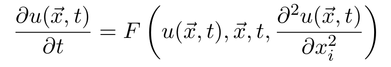
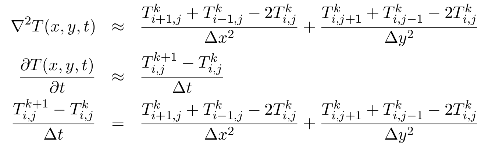

Parallelization of TFSP finite difference method for differential equations
===========================================================================

Background
~~~~~~~~~~

The Time-Forward, Space Centered  finite difference (TFSC-FD) method is a strategy to solve differentail equations of the form 

|diffeq|

The method is first-order accurate in time and second order accurate in space. 
In general, it works well for parabolic partial differential equation, and it is known to be unstable for hyperbolic one (unless some tricks are performed).

In particular, we will apply it to the heat equation in 2 dimensions

|heateq|

where T is the temperature field.

Discretization
~~~~~~~~~~~~~~

The discretization scheme we use is 

|discr|

In the TFSC-FD method, the time and space derivatives relevant to the heat equation are discretized as

|discreq|

So we can express the temperature field at time t+Dt and position (i,j) as 

|TFCS_heateq|

It can be proven that as sufficient condition fot this method to be stable is

|stability|
	
The serial code
~~~~~~~~~~~~~~~

The serial code implements the above algorithm for a 2D square domain of nx*ny points. 

The initial condition is set to be a gaussian distribution, centered in (x0,y0) with amplitudes (sigmax, sigmay)
 
Notice that the system actually allocates an array of size (nx+2)*(ny+2), and that the grid point with coordinates (i=1,j=1) is mapped to 
the array element 
::

  T[(nx+2)+1] 

This means that we have on the four boundaries an extra 1D array. This is done for the algorithm to work without problems for i=0, i=nx-1, j=0 and j=ny-1 without having special treatment for those points,
since to calculate the derivative we need for every point the value of the function at previous and following point in every direction. 

The boundaries cell are filled with the value of the neighbouring cell
::

  T(0,j) = T(1,j)
  T(nx+1,j) = T(nx,j)
  T(i,0) = T(i,1)
  T(i,ny+1) = T(i,ny)

this enforces FLAT boundary conditions. Please notice that in the above indexing, the first index represents the x direction and the second index the y direction (this is the reverse of the indexing 
of a matrix, where the first index indicates the rows and the second the columns).

|dom|

The script "animate.pl" is a gnuplot script that creates an animated gif (called animate.gif) from the data produced by the code. It automatically detects the number of frames, by reading the number of data "block" in the data file (a block in the gnuplot language is a group of data separate by 2 lines).  

The color plot range is regulated by 
::

  set cbrange [minT,maxT]

changing the value of sigmax and sigmay will change the maximum value of the function. 
The code prints the maximum value of the gaussian, and this should be the value of "maxT".

To run the script
::

  gnuplot animate.plt

You should get an animation like 

|anim|

