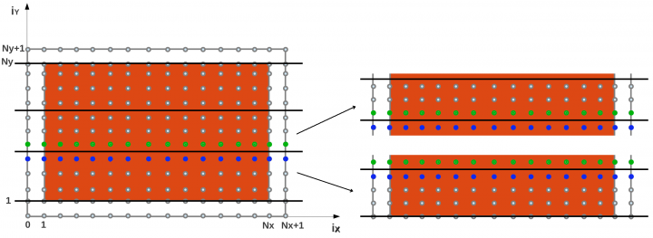

Assignment
==========

Parallelize this code using a domain decomposition method along the y axis.
~~~~~~~~~~~~~~~~~~~~~~~~~~~~~~~~~~~~~~~~~~~~~~~~~~~~~~~~~~~~~~~~~~~~~~~~~~~~~

This amounts to split the ny cells among the different processes, such that every process has a local number of points in y direction equal to nly.
However as deeply presented in class, to properly calculate the derivatives in the y direction, each processor will need data that belong to a different process, as depicted by
the green and blue points in the following plot.

|domdec|

These data need to be exchanged by each process. At every time step, each process updates the ghost-cell area, receiving the new data from the neighbour preocesses.

Keep in mind that the integral of the temperature field should be constant over time (corresponding to energy conservation). This is a first check that your parallelization is correct.

The steps to achieve the parallelization (as described within the template file) are:

1. Distribute the data among processes
2. Modify the initialization function (init) to properly split the initial temperature fields on each processor
3. Parallelize the update_boundaries function to handle boundaries and the ghost cells
4. Parallelize the calculation of the integral
5. Modify the save_gnuplot routine to correclty print the distributed data (in case of ny * nx <= 10000). 
6. Briefly comment performance and scalibility of the parallel implementation on a system size nx=ny=4000, nsteps=1000 and dt = 1e-7
7. (Optional) Consider the case in which the domain size is not a muliple of the number of processes

